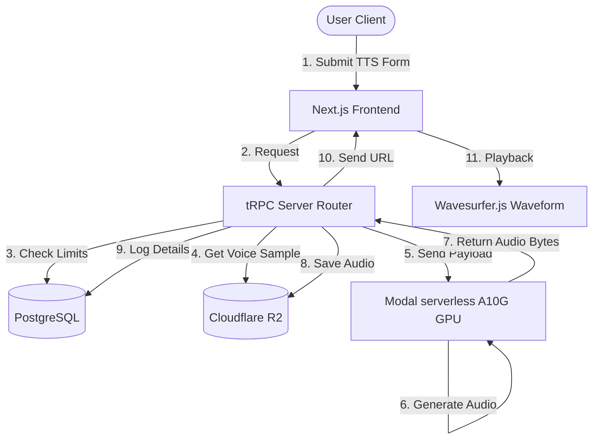
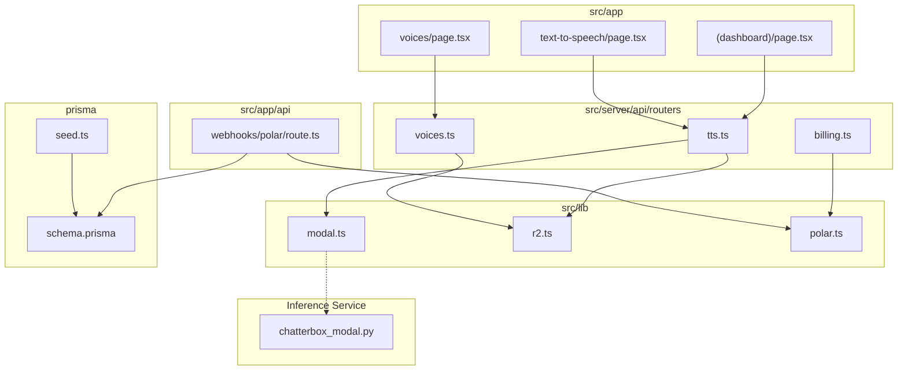
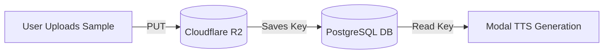
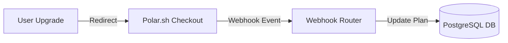
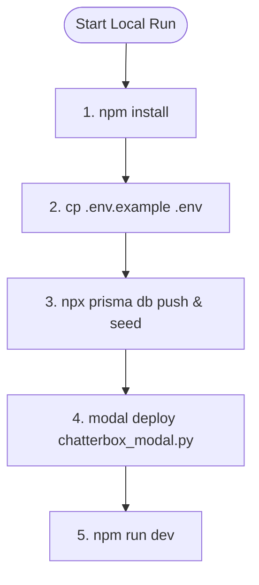

# 🎙️ Voicey

A Next.js platform for text-to-speech (TTS) and voice cloning using serverless GPU inference.

---

## 🛠️ How It Works

Voicey connects a Next.js front-end with a database, storage, and serverless GPU worker.



---

## 📁 Code Layout



---

## 🔄 Voice Cloning & Billing Flowcharts

### Voice Cloning Flow


### Polar Subscription Flow


---

## 🚀 How to Run the Website



### Commands:

```bash
# 1. Install packages
npm install

# 2. Setup env
cp .env.example .env

# 3. Setup database
npx prisma db push
npx prisma db seed

# 4. Deploy GPU service
modal deploy chatterbox_modal.py
# (Add the returned URL to MODAL_GENERATION_URL inside .env)

# 5. Start website
npm run dev
```
*(Open http://localhost:3000)*
